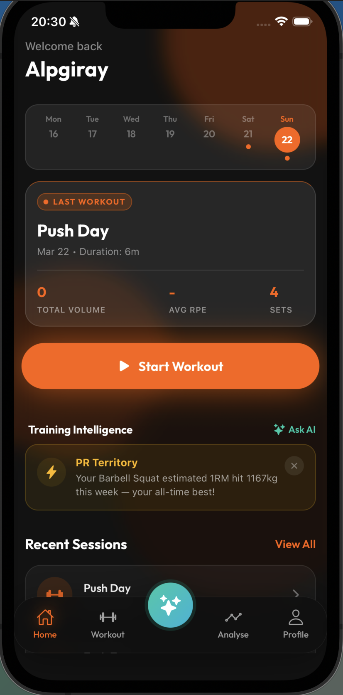
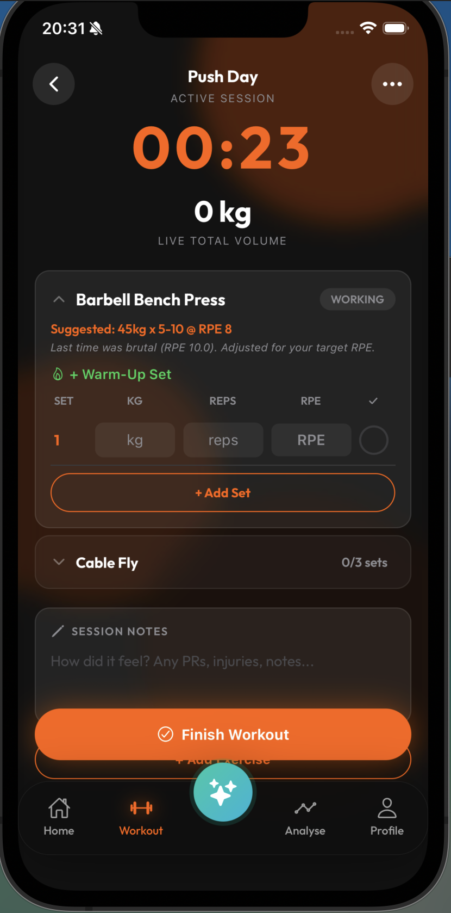
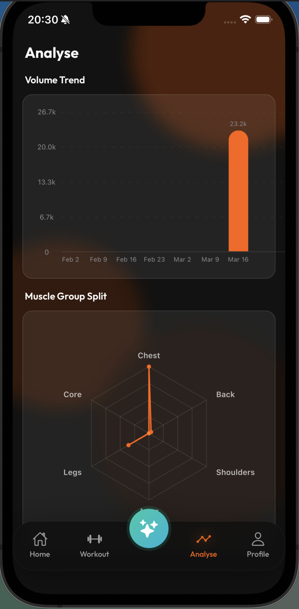
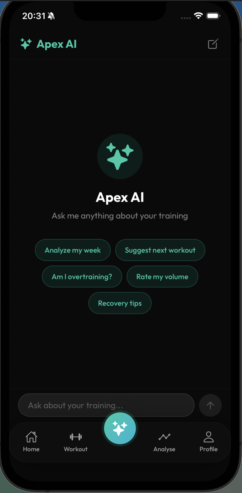
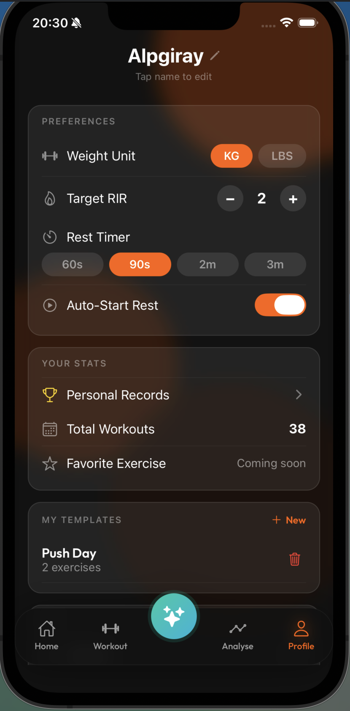

# Apex Coach

   

> An offline-first, RPE-driven training app with built-in AI coaching for serious weightlifters.

---

## Screenshots

<table>
  <tr>
    <td align="center"><br/><sub>Dashboard</sub></td>
    <td align="center"><br/><sub>Active Workout</sub></td>
    <td align="center"><br/><sub>Analyse</sub></td>
    <td align="center"><br/><sub>Apex AI</sub></td>
    <td align="center"><br/><sub>Profile</sub></td>
  </tr>
</table>

---

## Motivation

Most fitness apps get progressive overload wrong. Fitbod recommends weights based on muscle recovery estimations with no user input. Strong is just a digital notebook. None of them answer the real question:

**"Given how hard I worked last session, what should I lift today?"**

Apex Coach is built around RPE (Rate of Perceived Exertion) — the only metric that captures both absolute load and relative fatigue. Every progression suggestion is derived from the user's own performance data, not generic algorithms. And when you want a second opinion, the built-in AI coach has full context of your training history.

---

## Core Features

| Feature | Description |
|---|---|
| **RPE Tracking** | Log RPE (1–10) per set with half-point precision via iOS-style drum roll picker |
| **Progressive Overload Engine** | Analyzes last 3–6 sessions per lift. Suggests weight/reps based on RPE trend and target RIR |
| **Workout Plans** | Create reusable session blueprints with target sets, rep ranges, RPE goals, and pre-fill weights per exercise |
| **Personal Records** | Auto-tracked PRs: max weight, estimated 1RM (Epley formula), best set per exercise |
| **Analyse Dashboard** | Body heat map (last 7 days, front + back) + tappable Volume Trend and Muscle Split detail screens |
| **Training Reminder** | Local push notification fires 48 hours after last workout — re-arms automatically on each session completion |
| **Apex AI Coach** | Gemini-powered AI with full access to your training history. Ask anything — overtraining, next session, weekly analysis |
| **Cloud Sync** | Local-first architecture with automatic backend sync. Works offline, syncs when connected |
| **Auth** | Supabase-powered authentication with session persistence across app restarts |
| **Input Safety** | Realistic limits enforced at input time: max 500 kg weight, max 100 reps per set |

---

## Tech Stack

### Frontend

| Layer | Technology |
|---|---|
| Framework | React Native + Expo |
| Language | TypeScript |
| Styling | NativeWind (Tailwind CSS) + StyleSheet |
| Local Database | SQLite via `expo-sqlite` |
| State Management | Zustand (persisted via AsyncStorage) |
| Navigation | Expo Router (file-based) |
| Auth | Supabase JS (`@supabase/supabase-js`) |
| Charts | react-native-gifted-charts + react-native-svg |
| Body Map | react-native-body-highlighter (SVG muscle anatomy) |
| Notifications | expo-notifications (local scheduled) |
| Font | Outfit (Google Fonts via `@expo-google-fonts`) |

### Backend

| Layer | Technology |
|---|---|
| Framework | Spring Boot 4.0.3 |
| Language | Java 21 |
| Database | PostgreSQL 17 (Docker local / Supabase prod) |
| ORM | Spring Data JPA + Hibernate 7 |
| Migrations | Flyway (V1–V8) |
| Auth | Supabase Auth (JWT) + Spring Security OAuth2 Resource Server |
| AI | Gemini 3.1 Flash Lite (via REST — no SDK) |
| Validation | Jakarta Bean Validation |
| Testing | JUnit 5 + Mockito + Spring MockMvc (18 tests) |
| Deployment | Render (Docker) |
| Uptime | UptimeRobot (5-min pings to keep free tier alive) |

---

## Architecture

```
┌──────────────────────────┐         ┌──────────────────────────┐
│    React Native App      │  HTTP   │    Spring Boot 4 API     │
│    (Expo / TypeScript)   ├────────►│    (Java 21)             │
│                          │  JSON   │                          │
│  SQLite (local-first)    │◄────────┤  PostgreSQL 17           │
│  Zustand (state)         │         │  (Supabase managed)      │
└──────────┬───────────────┘         └──────────┬───────────────┘
           │                                    │
           │  Auth (JWT)                        │ Gemini REST API
           ▼                                    ▼
┌──────────────────────────┐         ┌──────────────────────────┐
│       Supabase           │         │   Google Gemini 3.1      │
│  - Auth (email/password) │         │   Flash Lite             │
│  - PostgreSQL (prod DB)  │         │  (training context +     │
│  - Session persistence   │         │   conversation history)  │
└──────────────────────────┘         └──────────────────────────┘
```

### Sync Strategy

Apex Coach uses a **local-first** architecture:

1. All UI screens read from **local SQLite** — zero network latency
2. Writes go to **SQLite immediately**, then fire-and-forget to backend
3. On login, backend data is **pulled and merged** into local SQLite (additive upsert)
4. Works fully offline — backend sync fails silently without blocking UX

```
Write path:  UI → SQLite (immediate) → Backend API (async, non-blocking)
Read path:   UI ← SQLite ← Backend (merged on login)
```

### AI Coach Architecture

The AI has full context of the user's recent training before answering:

```
User message → AiController
  → AiCoachService
    → TrainingContextService (builds compact summary of last 14 days)
    → GeminiRateLimiter (sliding window, 14 RPM)
    → GeminiService (REST call to Gemini API)
  ← AI response with tokensUsed
```

Chat history is persisted locally in SQLite (`chat_conversations` + `chat_messages`), never sent to the cloud.

### Backend Package Structure

```
com.apexcoach.api
├── config/          # SecurityConfig, CorsConfig, GeminiConfig
├── controller/      # REST endpoints (@RestController)
├── service/         # Business logic, GeminiService, AiCoachService, TrainingContextService
├── repository/      # Spring Data JPA interfaces
├── entity/          # JPA entities + enums
├── dto/             # Request/Response records with validation
└── exception/       # @ControllerAdvice global error handling

src/test/
├── service/
│   ├── WorkoutServiceTest       # Volume calc, RPE, ownership checks (7 tests)
│   └── PersonalRecordServiceTest # Epley formula, best-set selection (4 tests)
└── controller/
    └── WorkoutControllerTest    # MockMvc slice — CRUD + validation (6 tests)
```

### API Endpoints

All endpoints (except exercises and health) are user-scoped via JWT.

```
GET    /api/v1/health                   Health check

GET    /api/v1/exercises                List exercises (filterable: name, muscleGroup, equipment)
GET    /api/v1/exercises/{id}           Exercise detail
POST   /api/v1/exercises                Create custom exercise

POST   /api/v1/workouts                 Save workout session (nested: session → logs → sets)
GET    /api/v1/workouts                 History (paginated)
GET    /api/v1/workouts/{id}            Session detail with full set data
DELETE /api/v1/workouts/{id}            Delete session

GET    /api/v1/templates                List workout plans
POST   /api/v1/templates                Create workout plan
PUT    /api/v1/templates/{id}           Update workout plan
DELETE /api/v1/templates/{id}           Delete workout plan

GET    /api/v1/records                  All personal records for current user
GET    /api/v1/records/{exerciseId}     Personal record for exercise (max weight, est. 1RM via Epley)

POST   /api/v1/body-weight              Log body weight
GET    /api/v1/body-weight              Body weight history

POST   /api/v1/ai/chat                  AI chat (message + conversation history)
POST   /api/v1/ai/insights              AI training insights (day range)
```

---

## Project Structure

```
apex-coach/
├── app/                              # Expo Router — file-based navigation
│   ├── _layout.tsx                   # Root layout — auth gate, sync chain, onboarding, notifications
│   ├── (auth)/                       # Auth screens (login, signup)
│   │   ├── login.tsx
│   │   └── signup.tsx
│   ├── (tabs)/
│   │   ├── _layout.tsx               # Tab bar (BlurView glass, floating center AI button)
│   │   ├── index.tsx                 # Dashboard — last workout, weekly calendar, start button
│   │   ├── workout.tsx               # Active workout — timer, set editor, progressive overload
│   │   ├── coach.tsx                 # Apex AI — chat UI, quick actions, conversation history
│   │   ├── analyse.tsx               # Analyse — body heat map + tappable stat cards + history
│   │   └── profile.tsx               # Profile — preferences, workout plans, stats, sign out
│   ├── analyse/
│   │   ├── _layout.tsx               # Stack layout for detail screens
│   │   ├── volume.tsx                # Volume Trend detail — bar chart + summary stats
│   │   └── muscle-split.tsx          # Muscle Split detail — radar chart + ranked breakdown
│   ├── records.tsx                   # Personal records — Est. 1RM (Epley), best set per exercise
│   ├── workout/[sessionId].tsx       # Session detail view
│   └── template/
│       ├── create.tsx                # Create workout plan
│       └── [templateId].tsx          # Edit workout plan
│
├── src/
│   ├── components/
│   │   ├── workout/                  # ExercisePickerModal, StartWorkoutModal, RPESelector, ExerciseCard
│   │   ├── charts/                   # SpiderChart (SVG radar), VolumeBarChart (gifted-charts)
│   │   └── layout/                   # AnimatedBackground, OnboardingModal
│   ├── hooks/                        # useWorkoutSession, useProgressiveOverload
│   ├── lib/
│   │   └── supabase.ts               # Supabase client singleton (AsyncStorage adapter)
│   ├── services/
│   │   ├── storage/                  # SQLite CRUD: workoutStorage, exerciseStorage, templateStorage, chatStorage
│   │   ├── analytics/                # computeAnalytics.ts — weekly volume, muscle split, body heatmap
│   │   ├── notifications/            # workoutReminder.ts — 48h reminder scheduling
│   │   └── api/                      # client.ts (Bearer JWT), workoutApi, templateApi, exerciseApi, aiApi
│   ├── store/                        # Zustand: workoutStore, userStore, authStore
│   ├── types/                        # Strict interfaces: exercise.types, workout.types, chat.types
│   └── utils/                        # rpeCalculator (Epley), progressionLogic, formatters
│
├── .env                              # Environment variables (not committed)
│
└── backend/                          # Spring Boot 4 API
    ├── docker-compose.yml            # PostgreSQL 17 + pgAdmin (local dev)
    ├── Dockerfile                    # Production container (Render)
    ├── pom.xml                       # Maven — Spring Boot 4.0.3, Java 21
    └── src/
        ├── main/java/com/apexcoach/api/
        │   ├── config/               # Security, CORS, GeminiConfig (RestClient bean)
        │   ├── controller/           # REST controllers (workout, template, exercise, record, AI)
        │   ├── service/              # Business logic, GeminiService, AiCoachService, TrainingContextService
        │   ├── repository/           # JPA repositories
        │   ├── entity/               # JPA entities + enums
        │   ├── dto/                  # Request/Response DTOs
        │   └── exception/            # Global exception handler + Gemini exceptions
        ├── main/resources/
        │   ├── application.yml       # Base config (Gemini model, rate limit)
        │   ├── application-dev.yml   # Local DB (Docker)
        │   ├── application-prod.yml  # Supabase prod (env vars)
        │   └── db/migration/         # Flyway SQL migrations (V1–V8)
        └── test/java/com/apexcoach/api/
            ├── service/              # WorkoutServiceTest, PersonalRecordServiceTest
            └── controller/           # WorkoutControllerTest (MockMvc)
```

---

## Getting Started

### Frontend

**Prerequisites:** Node.js 18+, Expo Go app on your device or simulator.

```bash
git clone https://github.com/alpgi1/apex-coach.git
cd apex-coach
npm install
```

Create a `.env` file in the project root:

```env
EXPO_PUBLIC_SUPABASE_URL=your_supabase_url
EXPO_PUBLIC_SUPABASE_ANON_KEY=your_supabase_anon_key
EXPO_PUBLIC_API_BASE_URL=your_backend_url
```

```bash
npx expo start
```

Scan the QR code with Expo Go (iOS) or the Camera app (Android).

### Backend

**Prerequisites:** Java 21+, Docker Desktop.

```bash
cd backend

# Start PostgreSQL
docker compose up -d

# Run the API (dev profile active by default)
./mvnw spring-boot:run

# Health check
curl http://localhost:8080/api/v1/health

# Run tests
./mvnw test
```

Set `GEMINI_API_KEY` in your environment or `application-dev.yml` to enable the AI coach locally.

**pgAdmin:** http://localhost:5050 (admin@apexcoach.com / admin)

---

## Data Flow

```
User logs set → RPESelector (drum roll picker) → useWorkoutSession hook
  → Zustand store update (immediate UI feedback)
  → workoutStorage (SQLite INSERT — local persistence)
  → workoutApi.postWorkout (fire-and-forget → Spring Boot API → PostgreSQL)
  → scheduleWorkoutReminder() — (re)schedules 48h local notification

On login → exerciseApi.syncExercises (ID reconciliation)
        → workoutApi.fetchWorkouts → upsertWorkoutsFromBackend (SQLite merge)
        → templateApi.fetchTemplates → upsertTemplatesFromBackend (SQLite merge)

User sends AI message → coach.tsx
  → saveChatMessage (SQLite — local persistence)
  → aiApi.sendChatMessage (Spring Boot → TrainingContextService → Gemini REST)
  → AI response saved to SQLite + rendered in chat
```

---

## Roadmap

```
Phase 1 — Frontend MVP
  ✅ Type system and data contracts
  ✅ SQLite schema and storage layer
  ✅ Zustand state management
  ✅ Dashboard screen with workout history + weekly calendar
  ✅ Active workout screen with inline set editing
  ✅ Session detail screen
  ✅ Progressive overload algorithm (local, rule-based)
  ✅ Exercise library (seeded from ExerciseDB, lazy-load instructions)
  ✅ Profile screen (name, weight unit, target RIR, photo)
  ✅ Onboarding screen (first launch)
  ✅ Workout plan system (create, edit, delete, start from plan, pre-fill weights)
  ✅ Personal Records screen (Est. 1RM via Epley)
  ✅ RPE drum roll picker (iOS-style scroll picker with snap)
  ✅ Set auto-complete + swipe-to-delete
  ✅ Finish workout confirmation modal (animated BlurView sheet)
  ✅ Warmup sets — dedicated warm-up set type (excluded from volume)
  ✅ Rest timer — floating countdown bar with animated progress + auto-start on set complete
  ✅ Background rest timer notification — local notification fires when app is backgrounded
  ✅ Training reminder — 48h push notification after last workout
  ✅ Session notes — free-text note field per workout session
  ✅ Haptic feedback — NotificationFeedback on set complete / workout finish
  ✅ Collapsed / expanded exercise card view with auto-scroll
  ✅ Input validation — max 500 kg weight, max 100 reps enforced at input
  ✅ Analyse screen — body heat map (front + back, last 7 days)
  ✅ Analyse — tappable Volume Trend card → full-screen detail with stats
  ✅ Analyse — tappable Muscle Split card → full-screen radar + ranked breakdown
  ✅ Analyse history pagination (Show More / Show Less)
  ✅ UI polish — Outfit font, floating tab bar, card hierarchy, AnimatedBackground

Phase 2 — Backend + Cloud Sync
  ✅ Spring Boot 4.0.3 project scaffold
  ✅ PostgreSQL schema (Flyway V1–V8 — 8 tables + seed data)
  ✅ Docker Compose (PostgreSQL 17 + pgAdmin)
  ✅ Security + CORS + global exception handling
  ✅ JPA entities + repositories
  ✅ Exercise, Workout, Template, Personal Record, Body Weight endpoints
  ✅ DTO validation layer (Jakarta Bean Validation, ApiResponse<T>)
  ✅ Supabase Auth JWT integration (login/signup screens)
  ✅ Render deployment + UptimeRobot keep-alive
  ✅ Exercise ID sync (local SQLite UUID ↔ backend UUID reconciliation)
  ✅ Workout write sync (fire-and-forget POST after local save)
  ✅ Workout read sync (backend → local SQLite merge on login)
  ✅ Template CRUD sync with target weight per exercise
  ✅ Auth gate (session-aware routing, no login flash on restart)
  ✅ JUnit test suite — 18 tests (service unit tests + MockMvc controller tests)

Phase 3 — AI Coach
  ✅ Gemini 3.1 Flash Lite integration (Spring Boot REST, no SDK)
  ✅ Training context builder (last 14 days of workout data → compact LLM prompt)
  ✅ In-memory rate limiter (sliding window, 14 RPM)
  ✅ AI chat endpoint with conversation history support
  ✅ AI insights endpoint (day-range analysis)
  ✅ Center floating tab (gradient glow, spring animation, sparkles icon)
  ✅ Chat UI — message bubbles, quick action chips, empty state
  ✅ SQLite chat persistence (conversations + messages)
  ✅ Keyboard-aware input (dynamic padding, tap-to-dismiss)
  ✅ Dashboard "Ask AI" shortcut button
```

---

*Built for lifters who take their training seriously.*
